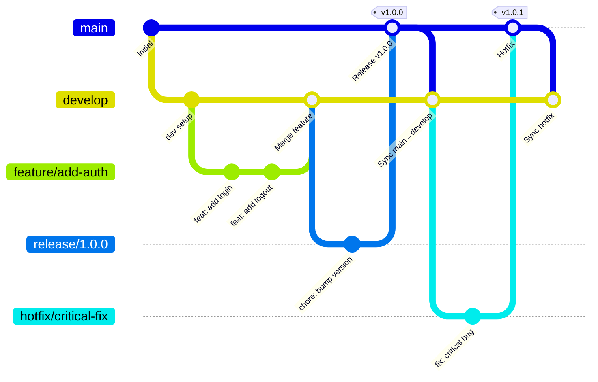

# ADR 0001: Development Process

## Context

flanは、AIアプリケーションとエージェントにTypeScriptとPythonスタックを使用しています。貢献者とコーディングエージェントは、ブランチ、コミット、テスト、ドキュメントの更新に関する共通の開発プロセスが必要

## Decision

### 開発プロセス

- **ブランチ戦略**: Git Flow採用（main/develop/feature branches）
- **コミットメッセージ**: conventional commits準拠、cz-emojiにて視覚的に一目で理解
- **テスト要件**: 単体テスト・統合テストの必須化
- **ドキュメント**: コード変更時は関連ドキュメントの更新を必須

---

### Gitブランチ規約

#### ブランチ命名規則

| プレフィックス | 用途 | 例 |
|---|---|---|
| `main` | 本番リリース済みコード（直接pushは禁止） | `main` |
| `develop` | 開発統合ブランチ（次期リリース） | `develop` |
| `feature/` | 新機能開発 | `feature/add-user-profile` |
| `fix/` | バグ修正 | `fix/login-redirect-error` |
| `hotfix/` | 本番緊急修正 | `hotfix/payment-null-crash` |
| `refactor/` | リファクタリング（機能変更なし） | `refactor/extract-auth-service` |
| `docs/` | ドキュメントのみの変更 | `docs/update-api-spec` |
| `chore/` | ビルド・設定・依存関係の更新 | `chore/upgrade-drizzle` |
| `test/` | テスト追加・修正のみ | `test/add-feed-integration` |

#### ブランチ命名の基本ルール

- スラッシュ（`/`）でプレフィックスと名前を区切る
- 名前部分はケバブケース（小文字 + ハイフン）: `feature/add-user-profile` ✅ / `feature/AddUserProfile` ❌
- 日本語は使用しない（CI/CDの互換性のため）
- 名前は簡潔かつ変更内容を表す動詞＋目的語: `add-`, `fix-`, `update-`, `remove-` 等を推奨
- Issue番号があれば末尾に付与: `feature/add-search-#42`

#### ブランチフロー



#### マージルール

- `main` へのマージ: `release/*` または `hotfix/*` からのみ（PR必須、直接pushは禁止）
- `develop` へのマージ: PR必須、最低1名のコードレビュー承認が必要
- `feature/*` / `fix/*` はすべて `develop` へマージ（`main` への直マージは禁止）
- squash mergeを推奨（コミット履歴をクリーンに保つ）

---

### Gitコミット規約

Conventional Commits + cz-emoji を採用。

#### コミットメッセージ形式

```text
<emoji> <type>(<scope>): <subject>

[body]

[footer]
```

#### タイプ一覧

| Emoji | Type | 用途 |
|---|---|---|
| ✨ | `feat` | 新機能の追加 |
| 🐛 | `fix` | バグ修正 |
| 🔥 | `hotfix` | 緊急バグ修正（本番影響） |
| ♻️ | `refactor` | リファクタリング（機能変更なし） |
| 📝 | `docs` | ドキュメントのみの変更 |
| 🎨 | `style` | フォーマット・コードスタイル（ロジック変更なし） |
| ✅ | `test` | テストの追加・修正 |
| 🚀 | `perf` | パフォーマンス改善 |
| 🔧 | `chore` | ビルド・設定・依存関係の更新 |
| 🗑️ | `remove` | コード・ファイルの削除 |
| 🔒 | `security` | セキュリティ修正 |
| 🚧 | `wip` | 作業中（WIP、原則としてmain/developへのマージ禁止） |

#### スコープ（scope）

変更対象のドメインやレイヤーを指定する（任意だが推奨）。

例: `auth`, `feed`, `paper`, `app`, `prompt`, `mcp`, `db`, `ui`, `api`, `config`

#### subjectのルール

- 現在形・命令形で記述（英語: `add`, `fix`, `update` / 日本語可）
- 先頭は小文字（英語の場合）
- 末尾にピリオドを付けない
- 50文字以内を目安
- subjectは日本語

#### 使用例

```text
✨ feat(auth): Google OAuthログインを追加

Better Auth の OAuthプロバイダーとしてGoogleを追加。
セッション管理はサーバーサイドクッキーで行う。

Closes #15
```

```text
🐛 fix(feed): 再取得時に重複するRSSエントリを防止する

RSSフィードの再取得時に重複エントリが生成されるバグを修正。
upsert処理にurl+publishedAtの複合ユニーク制約を利用。

Fixes #42
```

```text
♻️ refactor(paper): ロジックをドメインサービスに抽出
```

#### コミットの粒度

- 1コミット = 1つの論理的な変更
- `wip` コミットは作業完了前の一時保存用として許容するが、PRマージ前に squash すること
- 関係のない変更を1コミットにまとめない

## Consequences


- コーディング担当者は、リポジトリの変更を行う前に、このADR（代替文書規則）を参照
- プルリクエストはGit Flowに従い、cz-emojiを使用した従来のコミットを使用
- コードの変更には、関連するテストとドキュメントの更新が必要